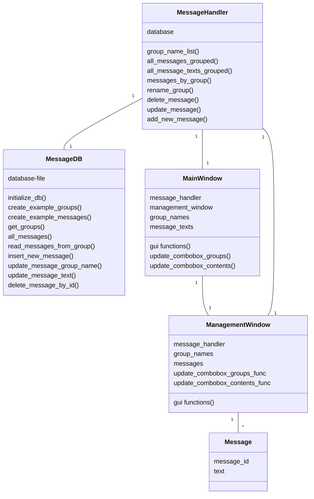

# Arkkitehtuurikuvaus

## Rakenne

Ohjelman koodi on tällä hetkellä jaettu kansioihin seuraavasti: 

src 
 - sisältää tiedoston index.py, jossa on main-luuppi ja joka käynnistää käyttöliittymän ja tietokannan
 - message_handler.py hoitaa tiedon käsittelyn ja siirron käyttöliittymän ja tietokantaa hoitavan luokan MessageDB välillä
 - message.py: Message-olioita käytetään säilyttämään ja kuljettamaan tietoa käyttöliittymässä ja MessageHandlerissa

src/ui 
 - sisältää käyttöliittymätiedostot ui_mainwindow.py ja ui_managementwindow.py

src/repositories
 - sisältää tiedoston db_messages.py, jonka luokka MessageDB alustaa tietokannan ja lähettää sinne tietokantakyselyt
 - tiedosto db_example_messages.py sisältää esimerkkiviestien sisällöt, joiden avulla voidaan luoda esimerkkitietokanta silloin, kun tietokantaa ei ole tallennettuna

src/tests
 - sisältää ohjelman automaattiseen testaamiseen käytettävät tiedostot

