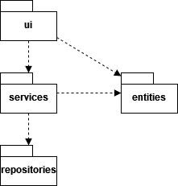
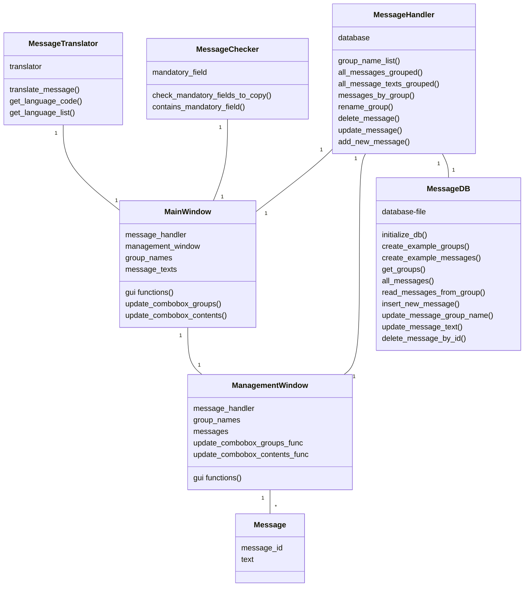
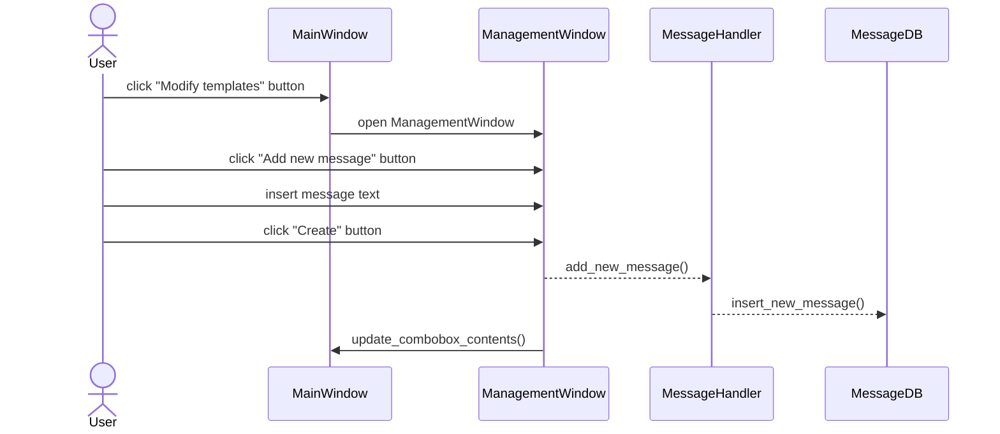

# Arkkitehtuurikuvaus

## Rakenne

Ohjelman koodi on jaettu kansioihin seuraavasti: 

src 
 - sisältää tiedoston index.py, jossa on main-luuppi ja joka käynnistää käyttöliittymän ja tietokannan

src/ui 
 - sisältää käyttöliittymätiedostot ui_mainwindow.py ja ui_managementwindow.py
 - sisältää tiedoston styles.py, jossa on kootusti käyttöliittymän komponenttien tyylimäärittelyt
 
 src/services 
  - sisältää viestipohjien käsittelyyn liittyviä palveluita 

src/repositories
 - sisältää tietojen pysyväistallennukseen liittyvän toiminnallisuuden, kuten tietokannan alustamiseen ja tietokantakyselyt

src/entities
 - sisältää sovelluksen käyttämiä tietokohteita kuvaavan Message-luokan

src/tests
 - sisältää ohjelman automaattiseen testaamiseen käytettävät tiedostot test_db_messages.py, test_message_handler.py, test_message_translator.py ja test_message_checker.py

## Käyttöliittymä

Kyttöliittymässä on kaksi luokkaa, ensimmäisenä käynnistyvä pääikkuna MainWindow ja tallennettujen viestipohjien muokkaamiseen käytettävä ManagementWindow. 

Kun ohjelma käynnistetään, ensimmäisenä käynnistyy MainWindow. Se sisältää tallennetut viestipohjat aiheen mukaisesti ryhmiteltyinä comboboxeihin, sekä tekstialueen, johon valitut viestipohjat tulostuvat ja jossa niitä voi muokata. Se sisältää myös napit viestiluonnoksen poistamiseen ja kopioimiseen, sekä napin jolla voi käynnistää ManagementWindow-ikkunan. MainWindow-ikkunan kokoa voi muuttaa vapaasti, ja tekstialueen koko määräytyy ikkunan koon mukaan.

ManagementWindow aukeaa omaan ikkunaansa MainWidown lisäksi. Se näyttää kaikki tallennetut viestipohjat aiheittain ryhmiteltyinä. Se tarjoaa muokkauskentät ja tallennusnapit viestiryhmien nimille, sekä kaikille viesteille. Ikkunassa voi myös poistaa viestejä ja lisätä kokonaan uusia viestejä. ManagementWindow-ikkunan kokoa voi muuttaa, mutta sisältö ei skaalaudu leveyssuunnassa, eikä ikkunaa voi kavetaa sisältöä pienemmäksi. Korkeussuunnassa ikkunassa on vierityspalkki, joten viestejä voi lisätä haluamansa määrän ilman että tila loppuu kesken.

MainWindow-ikkunan sisältö päivittyy reaaliaikaisesti, kun viestien muutoksia tai uusia viestejä tallennetaan ManagementWindow-ikkunassa. Molempia ikkunoita voi siis pitää auki ohjelman käytön aikana. Jos MainWindow-ikkunassa painetaan ManagementWindow-ikkunan avausnappia ikkunan ollessa jo avoinna, ohjelma ei luo toista ikkunaa, vaan siirtää avoinna olevan aktiiviseksi.

## Sovelluslogiikka
Ohjelman sovelluslogiikka sisältää toiminnallisuutta, joka liittyy tiedonkäsittelyyn ja tallentamiseen, tietokannan olemassa olon varmistamiseen, sekä viestin tarkistamiseen ja kääntämiseen toiselle kielelle. 

Useimmat ohjelman toiminnot käynnistetään käyttöliittymästä. Sovelluslogiikka jakautuu seuraavasti:

 ### src/services 
  - message_handler.py: MessageHandler-luokka hoitaa tiedon käsittelyn ja siirron käyttöliittymän ja tietokantaa hoitavan luokan MessageDB välillä
  - message_translator.py: MessageTranslator-luokka hoitaa viestien kääntämisen googletrans-kirjaston avulla
  - message_checker.py: MessageChecker-luokka tarkistaa onko viestiin jäänyt merkintöjä, jotka voisivat viitata puuttuviin tietoihin

### src/entities
 - message.py: Message-oliot kuvaavat viestipohjia, ja niitä käytetään säilyttämään ja kuljettamaan tietoa käyttöliittymässä ja MessageHandlerissa

## Tietojen pysyväistallennus

Tietojen tallennuksesta vastaa repositories-kansion MessageDB. Se tallentaa tietoa SQLite-tietokantaan. Reposities-kansiossa on myös db_example_messages.py-moduuli, jota käytetään esimerkkitietokannan alustamiseen.

### src/repositories
 - db_messages.py: luokka MessageDB alustaa tietokannan ja lähettää sinne tietokantakyselyt
 - tiedosto db_example_messages.py sisältää esimerkkiviestien sisällöt, joiden avulla voidaan luoda esimerkkitietokanta silloin, kun tietokantaa ei ole tallennettuna ohjelmaa käynnistettäessä

## Tiedostot

Sovellus tallettaa viestiryhmien nimet ja viestipohjat SQLite-tietokantaan. Viestiryhmät tallennetaan tauluun message_groups ja viestipohjat tauluun messages.

Tallennustiedosto sijaitsee sovelluksen juuressa olevassa kansiossa data, ja sen nimen voi vaihtaa sovelluksen juuresta löytyvässä .env-konfiguraatiotiedostossa.

## Päätoiminnallisuudet

### Uuden viestin luominen

Alla on sekvenssikaavio uuden viestipohjan luomisesta:

Ohjelman muu toiminnallisuus tapahtuu suoraan käyttöliittymän ja kyseisestä palvelusta vastaavan luokan välillä. Esimerkiksi ennen valmiin viestin kopiointia suoritettava tarkistus hoidetaan niin, että käyttöliittymän `MainWindow` kutsuu `MessageChecker`-luokan funktiota check_mandatory_fields_to_copy, ja viestin kääntäminen niin että `MainWindow` kutsuu `MessageTranslator`-luokan funktiota translate_message().

## Ohjelman rakenteeseen jääneet heikkoudet
MessageHandler-luokka tuo loppujen lopuksi aika vähän lisäarvoa käyttämänsä MessageDB-luokan toimintaan. Tästä seuraa päällekkäisyyttä, jonka vuoksi on aiheellista pohtia, onko parempi, että tietokantakyselyt ovat selkeästi omassa luokassaan kuten nyt, vai voisiko käyttöliittymä kutsua suoraan MessageDB-luokkaa.
