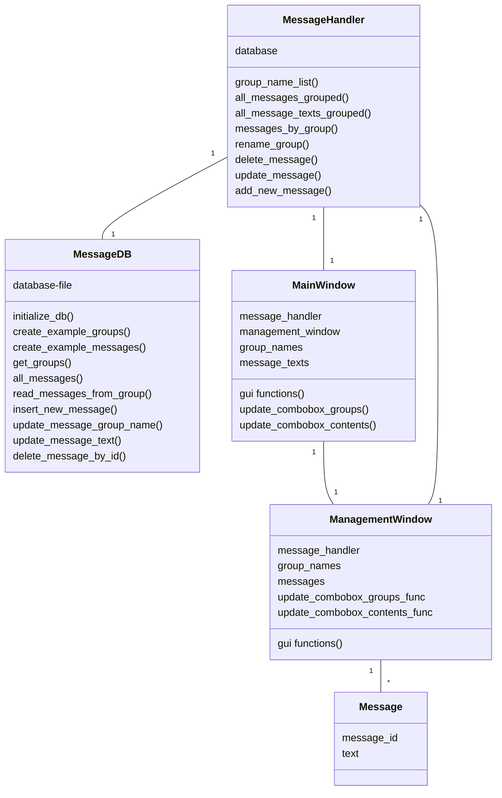
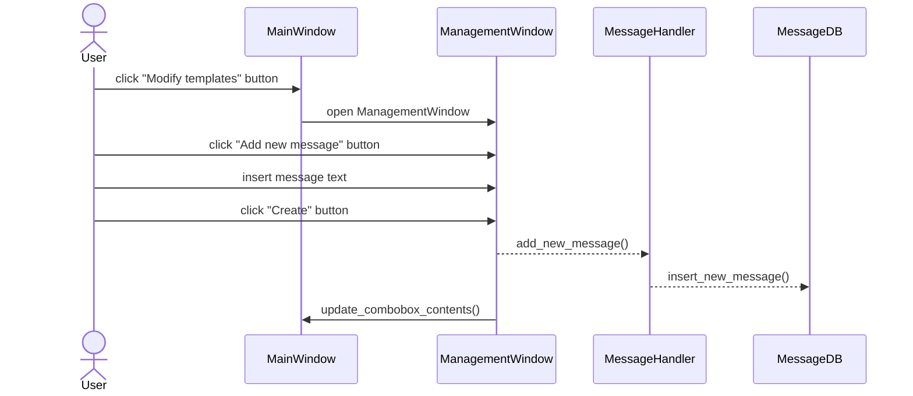

# Arkkitehtuurikuvaus

## Rakenne

Ohjelman koodi on tällä hetkellä jaettu kansioihin seuraavasti: 

src 
 - sisältää tiedoston index.py, jossa on main-luuppi ja joka käynnistää käyttöliittymän ja tietokannan
 - message_handler.py hoitaa tiedon käsittelyn ja siirron käyttöliittymän ja tietokantaa hoitavan luokan MessageDB välillä
 - message.py: Message-olioita käytetään säilyttämään ja kuljettamaan tietoa käyttöliittymässä ja MessageHandlerissa

src/ui 
 - sisältää käyttöliittymätiedostot ui_mainwindow.py ja ui_managementwindow.py

src/repositories
 - sisältää tiedoston db_messages.py, jonka luokka MessageDB alustaa tietokannan ja lähettää sinne tietokantakyselyt
 - tiedosto db_example_messages.py sisältää esimerkkiviestien sisällöt, joiden avulla voidaan luoda esimerkkitietokanta silloin, kun tietokantaa ei ole tallennettuna

src/tests
 - sisältää ohjelman automaattiseen testaamiseen käytettävät tiedostot

## Käyttöliittymä

Kyttöliittymässä on kaksi luokkaa, ensimmäisenä käynnistyvä pääikkuna MainWindow ja tallennettujen viestipohjien muokkaamiseen käytettävä ManagementWindow. 

Kun ohjelma käynnistetään, ensimmäisenä käynnistyy MainWindow. Se sisältää tallennetut viestipohjat aiheen mukaisesti ryhmiteltyinä comboboxeihin, sekä tekstialueen, johon valitut viestipohjat tulostuvat ja jossa niitä voi muokata. Se sisältää myös napit viestiluonnoksen poistamiseen ja kopioimiseen, sekä napin jolla voi käynnistää ManagementWindow-ikkunan. MainWindow-ikkunan kokoa voi muuttaa vapaasti, ja tekstialueen koko määräytyy ikkunan koon mukaan.

ManagementWindow aukeaa omaan ikkunaansa MainWidown lisäksi. Se näyttää kaikki tallennetut viestipohjat aiheittain ryhmiteltyinä. Se tarjoaa muokkauskentät ja tallennusnapit viestiryhmien nimille, sekä kaikille viesteille. Ikkunassa voi myös poistaa viestejä ja lisätä kokonaan uusia viestejä. ManagementWindow-ikkunan kokoa voi muuttaa, mutta sisältö ei skaalaudu leveyssuunnassa, eikä ikkunaa voi kavetaa sisältöä pienemmäksi. Korkeussuunnassa ikkunassa on vierityspalkki, joten viestejä voi lisätä haluamansa määrän ilman että tila loppuu kesken.

MainWindow-ikkunan sisältö päivittyy reaaliaikaisesti, kun viestien muutoksia tai uusia viestejä tallennetaan ManagementWindow-ikkunassa. Molempia ikkunoita voi siis pitää auki ohjelman käytön aikana. Jos MainWindow-ikkunassa painetaan ManagementWindow-ikkunan avausnappia ikkunan ollessa jo avoinna, ohjelma ei luo toista ikkunaa, vaan siirtää avoinna olevan aktiiviseksi.

## Sovelluslogiikka
Tällä hetkellä ohjelman sovelluslogiikka sisältää tiedonkäsittelyyn ja tallentamiseen, tietokannan olemassa olon varmistamiseen, sekä viestin kääntämiseen toiselle kielelle liittyvää toiminnallisuutta. 

Tarkoituksena on kehittää ohjelmaa siten, että sovelluslogiikkaan lisätään viestin sisältöön liittyviä tarkastuksia, sekä mahdollisesti undo- ja redo-toiminnot.

## Päätoiminnallisuudet

### Uuden viestin luominen

Alla on sekvenssikaavio uuden viestipohjan luomisesta:

