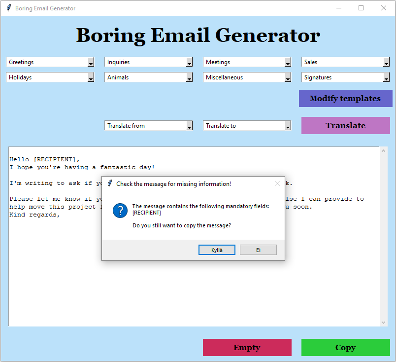

# Käyttöohje

## Ohjelmapaketin lataaminen Githubista ja purkaminen
Lataa ohjelman uusin [release](https://github.com/SaijaGit/ot-harjoitustyo/releases) Githubista valitsemalla _Assets_-osion alta _Source code_.  

## Konfigurointi

Ohjelma tallentaa viestipohjat sqlite-tietokannaksi tiedostoon, joka sijaitsee ohjelman juuressa _data_-hakemistossa. Testausta varten hakemistoon luodaan oma tiedosto. Jos tiedostoja ei ole, ohjelma luo ne oletusnimillä "messages.db" ja "test_messages.db".
Tiedostojen nimiä voi halutessaan muokata käynnistyshakemistossa _.env_-tiedostossa, jonka muoto on seuraava:

```
DATABASE = messages.db
TESTDATABASE = test_messages.db
```

## Ohjelman asennus ja käynnistäminen Poetry-ympäristössä

- Asenna riippuvuudet komennolla:

```bash
poetry install
```

- Käynnistä sovellus komennolla:

```bash
poetry run invoke start
```

## Ohjelman käytön aloittaminen


Koska ohjelma on tarkoitettu käytettäväksi paikallisesti henkilökohtaisella tietokoneella, siihen ei tarvitse kirjautua sisään. Ensimmäisellä käynnistyskerralla ohjelmassa on valmiina esimerkkiviestipohjia ja -ryhmiä käytön aloittamisen helpottamiseksi. 
Kun ohjelma käynnistyy, näkyviin tulee ohjelman pääikkuna. Siinä on seuraavat toiminnot:
-	8 alasvetovalikkoa, joissa on ryhmittäin jaoteltuina ohjelmaan tallennetut viestipohjat
-	Painike ”Modify templates”, joka avaa tallennettujen viestipohjien muokkausikkunan
-	Alasvetovalikot ”Translate from” ja ”Translate to”, joista valitaan kielet viestin kääntämistä varten
-	Painike ”Translate”, joka käynnistää viestin kääntämisen
-	Tekstikenttä, johon viestipohjat tulostuvat, ja jossa tekstiä voi muokata
-	Painike ”Empty”, joka tyhjentää viestikentän
-	Painike ”Copy”, joka kopioi viestikentän sisällön leikepöydälle
Mikäli haluat enemmän tilaa viestisi muokkaukseen, voit muuttaa ikkunan kokoa reunoista vetämällä ja tekstikentän koko muuttuu vastaavasti. 

## Viestipohjien muokkaaminen
### Hallintaikkuna 


Kun haluat muuttaa ohjelman tietokantaan tallennettujen viestiryhmien nimiä tai muokata ryhmien sisältöä, klikkaa ”Modify templates” -painiketta. Siitä aukeaa ”Manage Message Templates” -hallintaikkuna, jossa on seuraavat toiminnot:
-	Ikkunan vasemmassa laidassa ovat viestiryhmien numerot ja nimet
-	Jokaisen ryhmän nimen vieressä on tekstikenttä ja ”Rename group” -painike nimen vaihtamista varten
-	Jokaiselle ryhmän viestipohjalle on tekstikenttä, jossa sitä voi muokata, sekä ”Save” -painike muutosten tallentamista varten
-	Jokaisella viestipohjalla on ”Delete” -painike, jolla viestin voi poistaa tietokannasta

Hallintaikkuna aukeaa ohjelman pääikkunan päälle. Käyttäjä voi pitää sen auki, ja työskennellä molemmissa ikkunoissa vuorotellen. Jos pääikkunan ”Modify templates” -painiketta painetaan hallintaikkunan jo ollessa auki, ohjelma ei avaa uutta hallintaikkunaa vaan aktivoi olemassa olevan.
Hallintaikkunassa on vierityspalkki, ja sen kokoa voi myös säätää korkeussuunnassa.
 
### Viestiryhmän nimen vaihtaminen
Kirjoita uusi nimi tekstikenttään ja klikkaa ”Rename group” -painiketta. Ryhmän nimi tallentuu ohjelman tietokantaan ja päivittyy heti myös pääikkunan alasvetovalikkoon.

### Viestipohjan muokkaaminen
Viestipohjien tekstit näkyvät tekstikentissä, jossa niitä voi myös muokata. Muutokset tallennetaan ohjelman tietokantaan klikkaamalla ”Save” -painiketta. Tallennetut muutokset päivittyvät heti myös pääikkunan alasvetovalikoihin. 
Jos haluat sisällyttää viestipohjaan pakollista tekstiä, esimerkiksi vastaanottajan nimen, kirjoita se hakasulkuihin. Hakasuluissa olevan tunnustekstin pituus voi olla korkeintaan 20 merkkiä. Esimerkkikuvan viestipohjissa on määritelty vastaanottajan nimi pakolliseksi lisäämällä viesteihin [RECIPIENT] -tunnus. Määrittelemällä viestipohjiin pakollista tietoa voidaan varmistaa, että ohjelma huomauttaa käyttäjää, jos hän yrittää kopioida pääohjelmasta viestitekstin, jossa on puuttuvaa pakollisen tiedon tunnukseksi tulkittavaa tekstiä.

### Viestipohjan poistaminen
Viestipohjan voi poistaa ohjelman tietokannasta klikkaamalla kyseisen viestin alla olevaa ”Delete” -painiketta. Muutos päivittyy heti myös ohjelman pääikkunaan kyseisen ryhmän alasvetovalikkoon.

### Uuden viestipohjan lisäys

Viestiryhmään voi lisätä uuden viestin klikkaamalla ryhmän otsikkorivillä olevaa ”Add new template” -painiketta. Se avaa ryhmän viestien perään uuden tekstikentän, johon viestipohjan teksti kirjoitetaan. Uuden viestin voi lisätä ohjelman tietokantaan tekstikentän alla olevalla ”Create” -painikkeella. Se lisää viestipohjan myös kyseisen ryhmän valikkoon pääikkunassa.
Viestipohjan lisäyksen voi perua tekstikentän alla olevalla ”Cancel” -painikkeella. Se poistaa uuden viestin tekstikentän sekä siihen liittyvät painikkeet hallintaikkunasta. 

## Sähköpostiviestien luominen ohjelman pääikkunassa
### Viestipohjien lisäys


Valitse lisättävät viestipohjat valikoista haluamassasi järjestyksessä. Viestipohjien tekstit tulostuvat tekstikenttään, jossa voit muokata niitä tai kirjoittaa viestiin myös muuta tekstiä. Korvaa hakasuluilla pakollisiksi merkityt tiedot oikeilla tiedoilla. 

### Viestin kääntäminen


Ohjelma tarjoaa mahdollisuuden viestin kääntämiseen. Valitse lähtökieli ”Translate from” -valikosta ja kieli, jolle viesti käännetään ”Translate to” -valikosta, ja klikkaa ”Translate” -painiketta. Ohjelma kääntää tekstin pyydetylle kielelle. Käännös haetaan Googlen ilmaisesta käännöspalvelusta, joka valitettavasti toimii toisinaan hieman epäluotettavasti, eikä käännöksen laatu ole paras mahdollinen. Käännöksen ollessa kesken näytöllä näkyy teksti ”Please wait patiently while the translation is requested from the online service”.

#### Käännöksen epäonnistuminen


Koska käännös haetaan internetissä toimivasta käännöspalvelusta, se saattaa joskus epäonnistua, esimerkiksi verkkoyhteyden tai palvelimen ongelmien vuoksi. Ohjelma yrittää pyytää käännöstä 5 kertaa, mutta jos se ei tuota tulosta, ohjelma ilmoittaa epäonnistumisesta ja pyytää käyttäjää valitsemaan jatketaanko yrittämistä uudet 5 kertaa, vai peruutetaanko käännöspyyntö.

## Valmiin viestin vieminen sähköpostiohjelmaan


Kun sähköpostiviesti on valmis, klikkaa ”Copy”, jolloin tekstialueen sisältö kopioituu tietokoneen leikepöydälle, josta voit liittää sen edelleen sähköpostiohjelmaasi.



Jos viesti sisältää tässä vaiheessa hakasuluissa olevaa tekstiä, jonka ohjelma tulkitsee merkitsevän puuttuvaa pakollista tietoa, ohjelma pyytää käyttäjää tarkistamaan viestin sisällön ja kysyy, haluaako käyttäjä kopioida viestin tästä huolimatta, vai palata vielä muokkaamaan viestiä. Ilmoitusikkunassa on lista sanoista, joiden ohjelma epäilee merkitsevän puuttuvaa pakollista tietoa.


