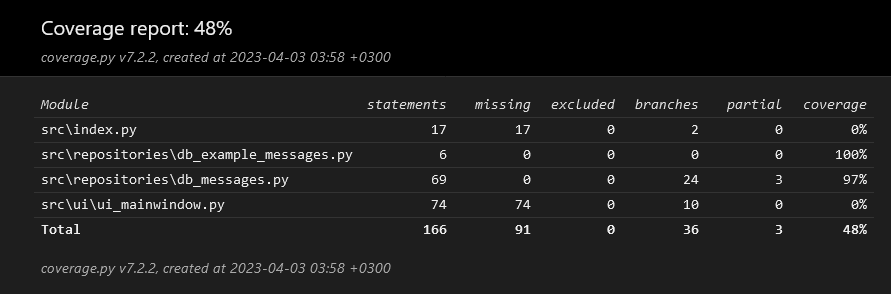

# Testausdokumentti
Tässä vaiheessa ohjelma sisältää pääasiassa tietokantaan ja käyttöliittymään liittyvää toiminnallisuutta.
Ohjelmaa on testattu sekä automatisoidusti unittestilla, ja käyttöliittymää on testattu manuaalisesti.

## Yksikkö- ja integraatiotestaus

### Sovelluslogiikka ja Repositorio-luokat
Tietokantaa käsittelevä luokka `MessageDB` sisältää jonkin verran tietokannan olemassa olon varmistamiseen ja haetun tiedon käsittelyyn liittyvää sovelluslogiikkaa. Myöhemmässä vaiheessa tämä toiminnallisuus tullaan todennäköisesti jakamaan osiin niin, että tiedon käsittely ja tietokannalle lähetettävät viestit ovat omissa luokissaan.
Tämänhetkistä luokkaa testataan [TestMessageDB](https://github.com/SaijaGit/ot-harjoitustyo/blob/main/BoringEmailGenerator/src/tests/test_db_messages.py)-testiluokalla. 

### Testauskattavuus

Tällä hetkellä sovelluksen testauksen haarautumakattavuus on 48%, mutta varsinaisesti testatun MessageDB-luokan osalta 97%.

