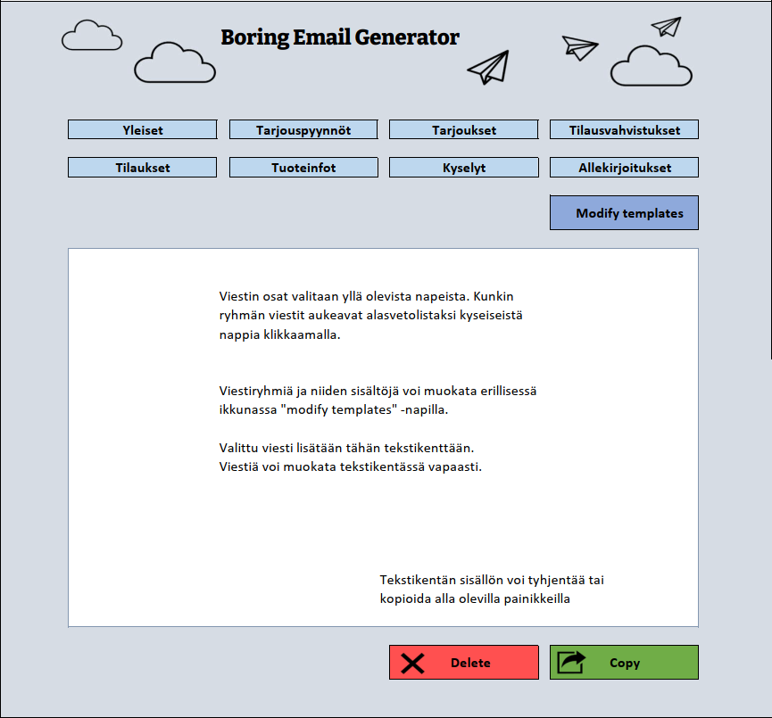
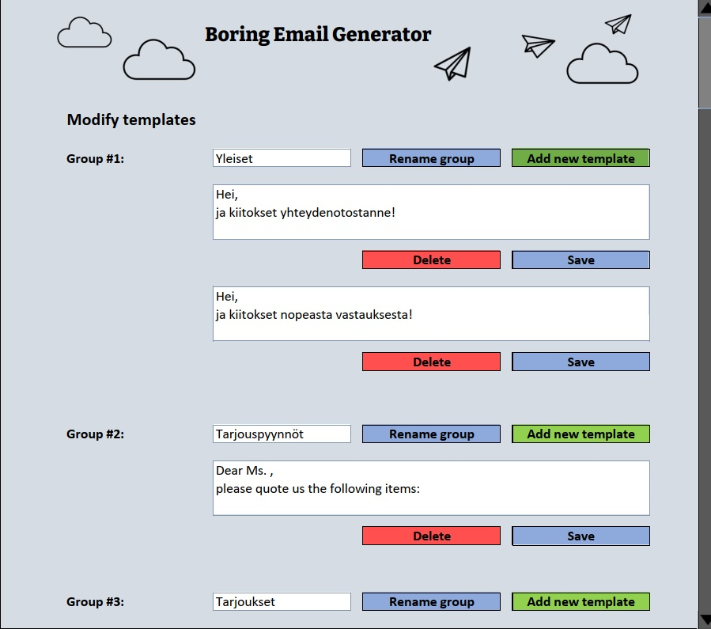

# Vaatimusmäärittely

## Sovelluksen tarkoitus

Sovelluksen tarkoitus on auttaa käyttäjää luomaan yksinkertaisia sähköpostiviestejä nopeasti ja helposti. Monet ihmiset joutuvat kirjoittamaan työssään tylsiä rutiiniviestejä, joissa on yhä uudelleen ja uudelleen samaa sisältöä. Tämän sovelluksen avulla käyttäjä pystyy koostamaan sähköpostiviestejä valmiista viestipohjista.

Käyttäjä voi tallentaa usein kirjoittamansa viestit sovellukseen. Viestipohjat jaotellaan omiin ryhmiinsä, mikä helpottaa halutun tekstipätkän löytämistä. Valitut viestin osat näytetään tekstikentässä, jossa niitä voi tarvittaessa myös muokata. Kun viesti on valmis, käyttäjä voi kopioida sen liittääkseen sen sähköpostiohjelmaansa.

## Perusversion tarjoama toiminnallisuus (18.4. kaikki tehty)
-	Sovelluksessa on valmiina viestiryhmät ja muutamia yleisiä viestipohjia.
-	Viestipohjat on jaoteltu ryhmiin ja ne saa näkyviin kyseisen ryhmän napista klikkaamalla.  
-	Viestipohjat aukeavat pudotusvalikoksi, josta ne voi valita klikkaamalla.
-	Valitut viestin osat tulostuvat tekstikenttään, jossa niitä voi muokata.
-	Kun viesti on valmis, sen voi kopioida tietokoneen leikepöydälle ”Copy”-napista.
-	Tekstikentän voi tyhjentää ”Delete”-napilla.
-	Käyttäjä voi muokata viestiryhmiä ja -pohjia ”Modify templates”-napista aukeavassa ikkunassa.
-	Muokkausikkunassa voi vaihtaa ryhmien nimet, lisätä ryhmiin uusia viestipohjia sekä poistaa viestipohjia sovelluksesta.

## Käyttäjät
Sovelluksessa on vain yksi käyttäjä. Koska sovellus on tarkoitettu toimimaan työpöytäsovelluksena ja tallentamaan tiedot käyttäjän omalle tietokoneelle, siinä ei tarvita erillistä käyttäjätiliä tai sisäänkirjautumista.

## Käyttöliittymäluonnos
Sovelluksessa on kaksi ikkunaa. Ensimmäisenä avautuu pääikkuna, jossa viestit koostetaan. ”Modify templates”-napilla aukeaa muokkausikkuna, jossa sovelluksen tallentamia viestipohjia voi muokata.

Käyttöliittymäluonnokset on tehty Excelillä, ja kuvitukset ovat Excelin ikoneita.

## Jatkokehitysideat
Sovellukseen voisi kehittää hakutoimintoja ja filttereitä haluttujen viestin löytämisen helpottamiseksi. Sopivia filttereitä voisivat olla esimerkiksi viestin kieli ja tyylilaji (muodollinen / tuttavallinen). Tätä varten ohjelmaan pitäisi lisätä viestikategoriat, jotka lisättäisiin viesteille luomisvaiheessa.

Toinen hyödyllinen ominaisuus olisi mahdollisuus siirtää viestejä ryhmästä toiseen ja vaihtaa niiden järjestystä ryhmässä.
Sovellukseen voisi lisätä myös mahdollisuuden merkitä tietyt viesti suosikeiksi, jolloin ne näkyisivät automaattisesti listan alussa.

Muita jatkokehitysideoita ovat ”Undo” -nappi, jolla käyttäjä voisi perua tekemiään muokkauksia, sekä viestipohjien tallennus suoraan pääikkunan tekstikentästä.
