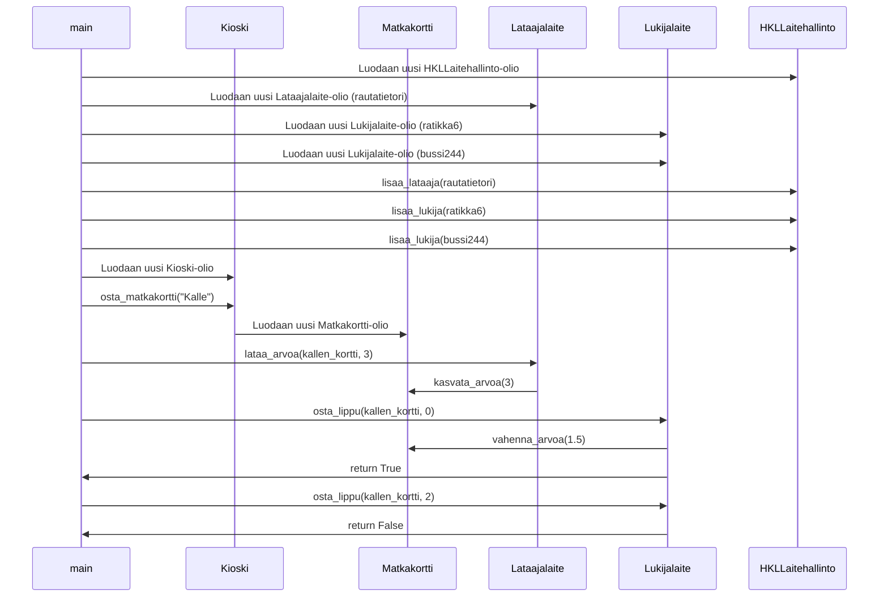

# Ohjelmistotekniikka, kevät 2023 - Tehtävät
## Viikko 3
### Tehtävä 3: Sekvenssikaavio

Sekvenssikaavio kuvitteellisen HSL-matkakorttien hallintaan käytettävän koodin main-funktion toiminnallisuudelle.

Sekvenssikaavio:

