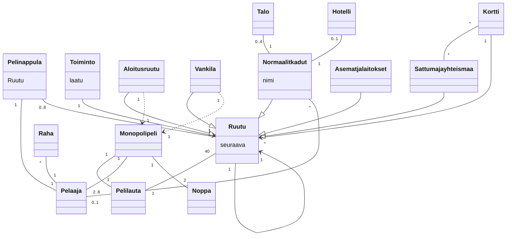

# Ohjelmistotekniikka, kevät 2023 - Tehtävät
## Viikko 3
### Tehtävä 2: Laajennettu Monopoli

Laajennetaan edellisen tehtävän luokkakaaviota tuomalla esiin seuraavat asiat:

- Ruutuja on useampaa eri tyyppiä: Aloitusruutu, Vankila, Sattuma ja yhteismaa, Asemat ja laitokset, Normaalit kadut (joihin liittyy nimi)
- Monopolipelin täytyy tuntea sekä aloitusruudun että vankilan sijainti.
- Jokaiseen ruutuun liittyy jokin toiminto.
- Sattuma- ja yhteismaaruutuihin liittyy kortteja, joihin kuhunkin liittyy joku toiminto.
- Toimintoja on useanlaisia. Ei ole vielä tarvetta tarkentaa toiminnon laatua.
- Normaaleille kaduille voi rakentaa korkeintaan 4 taloa tai yhden hotellin. Kadun voi omistaa joku pelaajista. Pelaajilla on rahaa.

Luokkakkaavio:

