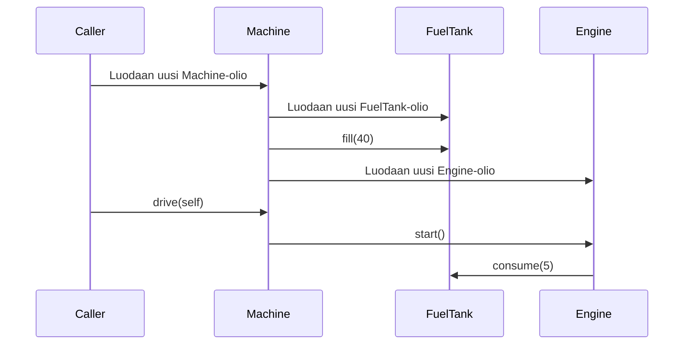

# Ohjelmistotekniikka, kevät 2023 - Tehtävät
## Viikko 3
### Tehtävä 3: Sekvenssikaavio

Sekvenssikaavio koneelle, joka koostuu bensatankista ja moottorista.

Kaaviossa on kuvattu tilanne, jossa kutsutaan (jostain koodin ulkopuolella olevasta metodista) ensin Machine-luokan konstruktoria ja sen jälkeen luodun Machine-olion metodia drive.

Sekvenssikaavio:

